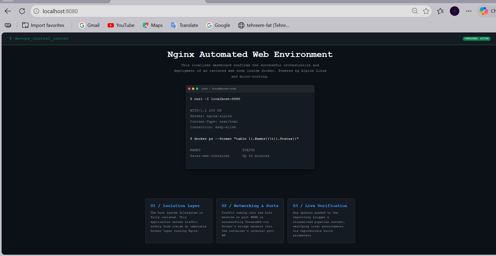
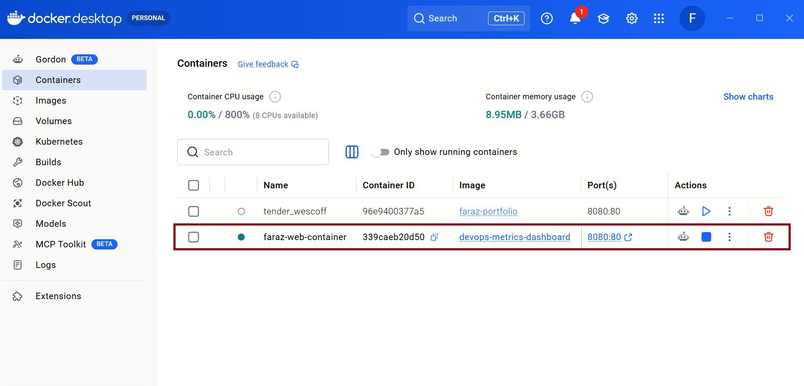
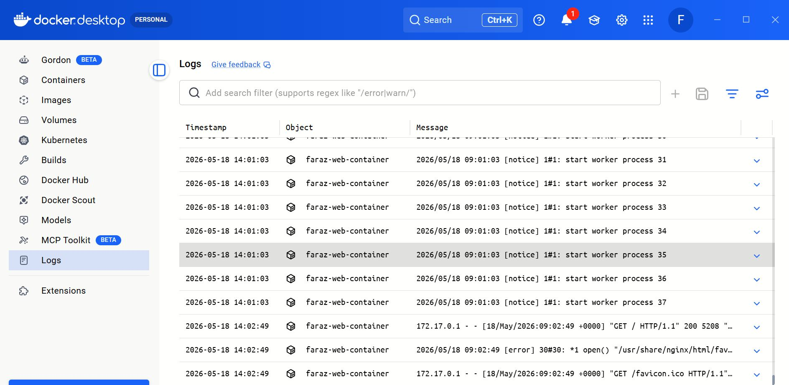

# 🐳 Task 4: Web Server Containerization using Docker

## 🚀 Project Overview
This repository contains my official submission for **Task 4** of the **CodeAlpha DevOps Internship**. The core objective of this assignment is to master containerization fundamentals by deploying, configuring, and managing a high-performance web server environment inside an isolated Docker container.

Instead of a generic template site, this deployment hosts a customized, production-ready **DevOps Control Center & Metrics Dashboard** that interfaces with internal web assets using an optimized Nginx distribution. To demonstrate real-world cloud deployment patterns, the local container infrastructure is securely exposed to the global internet via an active Ngrok tunnel.

### What this project contains:
* **Dockerfile:** Multi-layered engineering blueprint for building our custom minimal web server image.
* **Web Content:** A custom-coded HTML5/CSS3 terminal-themed DevOps telemetry dashboard page.
* **Container Logic:** Ingress port mapping (`8080:80`) to bridge the host machine and the isolated container interface.
* **Global Tunnel:** Live integration with Ngrok to enable edge routing for cross-device visibility testing.

---

## 🏗️ Architecture & Workflow
The deployment operations follow the native DevOps **"Build-Ship-Run"** lifecycle paradigm:
1. **Code:** Structured localized dashboard assets and developed an optimized `Dockerfile`.
2. **Build:** Docker Engine reads instructions to compile static source configurations into an immutable layer.
3. **Run:** Docker instantiates an isolated container system based on the generated local target image.
4. **Expose:** The internal Nginx server listener (Port 80) is mapped seamlessly to the Local Host system interface (Port 8080).
5. **Tunnel:** Ngrok dynamically generates a secure public edge URL to route external incoming packets directly down to the local runtime container.

---

## 🛠️ Tech Stack & Environment
| Category | Technology |
| :--- | :--- |
| **Containerization Engine** | Docker Engine / Docker Desktop |
| **Base Web Server** | Nginx (`alpine` lightweight minimal distribution) |
| **Underlying Kernel** | WSL 2 (Windows Subsystem for Linux) |
| **Exposure Tunnel** | Ngrok (Secure External Ingress) |
| **Frontend UI Layer** | Semantic HTML5 / Responsive CSS3 (Monospace Terminal Theme) |

---

## 🚀 Local Deployment Instructions

To initialize and deploy this infrastructure component on your local workstation, run the following workflow:

### 1. Clone the Repository
```bash
git clone https://github.com/farazii1159/CODEALPHA_Devops_TASK_4.git

cd CODEALPHA_Devops_TASK_4
```
---

## 🏗️ Core Workflow Lifecycle: Build, Ship, & Run

### 1. Build the Isolated Docker Image

To read the structural blueprints defined in the `Dockerfile` and compile the static assets into an immutable image layer, execute:

```bash
docker build -t devops-metrics-dashboard .
```

### 2. Inspect Local Images

Verify that the image has been successfully created and registered with the local Docker daemon:

```bash
docker images
```

### 3. Initialize and Run the Container

Spin up the container in detached mode (-d), assign a customized runtime name, and forward traffic from host port 8080 to container port 80:

```bash
docker run -d -p 8080:80 --name faraz-web-container devops-metrics-dashboard
```

### 4. Monitor Container Status & Logs
Verify the health status and internal process telemetry of the active container:

```Bash
# Check running status
docker ps

# Inspect real-time server runtime logs
docker logs faraz-web-container

```

Local Ingress URL: Open your browser and access http://localhost:8080


### 📂 Project Repository Structure Plaintext

```bash
CODEALPHA_Devops_TASK_4/
├── Dockerfile          # Multi-layered Docker build instructions
├── index.html          # Customized DevOps Metrics Dashboard UI
├── README.md           # Professional project documentation
└── images/             # Documentation screenshots folder 

```

## 📸 Project Verification Screenshots
### 1. DevOps Control Center Local UI
Validation confirming our engineered **DevOps Control Center & Metrics Dashboard** rendering natively on the host interface over port `8080`.




## 2. Docker Desktop Container Registry
Telemetry status readout displaying the **faraz-web-container** environment running optimally with minimal resource footprint (**8.95MB**).




## 3. Nginx Worker Process Telemetry Logs
Live application container logs streams verifying active worker routines and server responses.




### Project documentation

### 🧠 Technical Competencies Gained
 
Alpine Optimization: Applied modern production architectures by using nginx:alpine to systematically minimize attack vectors, dependencies, and deployment file sizes.

Port Address Translation: Conceptualized routing flows showing how external boundary packets transit across Docker’s virtual bridge networks down to internal private application layers.

State Management & Lifecycle: Mastered low-level infrastructure operations including instance spawning, execution monitoring, pipeline logs tracking, and immutable environment setups.

Environment Synchronization: Handled runtime operations and host system resource binding smoothly across the WSL 2 subsystem layer.

---

### 🚀 Nayi Files Ko GitHub Par Kaise Bhejein?

Ab aap apne local project workspace ke `images` folder mein teenon screenshots (`dashboard-ui.jpg`, `faraz_container.JPG`, `logs_monitoring.JPG`) save kar lene ke baad terminal mein ye commands execute kar dein:

```bash
git add .

git commit -m "docs: sync dynamic metrics logs and real container telemetry to readme"

git push origin main
```

--- 

## 👨‍💻 Author

**Faraz Shabbir**

- GitHub: [farazii1159](https://github.com/farazii1159)
- LinkedIn: [Faraz Shabbir](https://linkedin.com/in/faraz-shabbir-5a9227344)
- Organization / Affiliation: CodeAlpha
- Company: [CodeAlpha](https://www.linkedin.com/company/codealpha/)

---
**Submitted by:** Faraz Shabbir (CodeAlpha DevOps Program Participant)